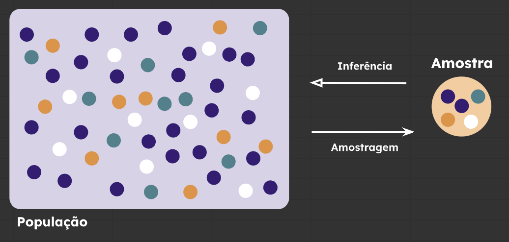
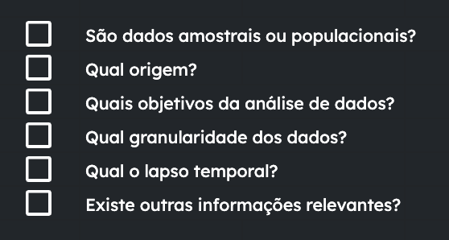
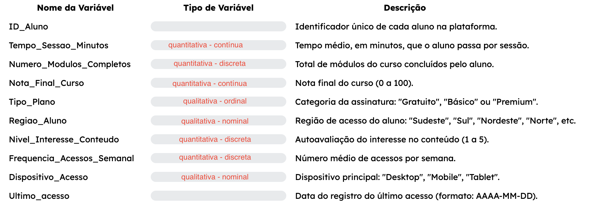

# Estatística

## População x Amostra

- população é todo o conjunto possível
    - precisa de muitos recursos para lidar com todos os dados da população
    - as vezes não é possível fazer com todos os elementos
    - falta dinheiro, falta capacidade computacional, se fizer com todos vai usar todos e não vai poder vender/utilizar pra finalidade real daquela população
- amostra é um subconjunto **representativo** extraído da população
    - tem um grau de incerteza
- amostragem é o que vem da população, inferência é o que vai da amostra para a população

## Tipos de estatística

- descritiva: resume os dados, descreve, explora, organiza e apresenta
- inferencial: interpreta os dados da amostra, e conclui coisas sobre a população
    - testes de amostras
    - margem de incerteza
    - diferentes formulas (media populacional ou media amostral)

## análise univariada

1. contexto de um conjunto de dados
    - fazer perguntas sobre o contexto para entender de onde vem e as caracteristicas desses dados
        - exemplo de algumas perguntas:
        
    - granularidade: nível de detalhe ou precisão com que os dados são registrados e analisados
2. conheça suas variáveis
    - variavel é tudo que voce está observando naquele conjunto de dados
    - tipos:
        
        a. qualitativa

        - atributos e qualidades

            i. nominal: não tem ordem (ex: cor de cabelo)
        
            ii. ordinal: tem uma ordem especifica (grau de escolaridade)

        b. quantitativa

        - números, que de pra calcular e tirar metricas

            i. discreta: enumerar a quantitidade, apenas numeros inteiros (numero de filhos)

            ii. continua: tem numeros com virgula, decimais (peso, salário)

3. resumo dos dados
    
    a.i apenas tabela de frequencia - o quanto aquilo representa e o quanto tem
    
    a.ii tabela de frequencia OU:

    - tabela de frequencia acumulada - vai somando o percentual com o percentual do anterior
        - faz sentido pois a `qualitativa ordinal` pressupões uma ordem correta, então não vai bagunçar os dados

    a. os melhores graficos são de setores (pizza), barras ou colunas - podemos usar gráficos mistos também

    b.i pode usar tabela de frequencia, mas tem outras tecnicas melhores, para a tabela não ficar gigante

    - medidas resumo:
        - media
        - mediana - ordena do menor pro maior, entende qual o meio deles.
        - moda
        - desvio padrão - não faz muito sentido sozinho
            - intervalo no qual está inserido um valor da media ou da mediana
        - variância
        - quartil - vem da mediana, mas em quatro partes
            - Q1 - os primeiros 25%
            - Q2 - os primeiros 50%
            - Q3 - os primeiros 75%
        - minimo
        - máximo - é o "quartil" Q4, ou seja, 100% da nossa base
        - assimetria
            - função distorção no excel
            - descreve a simetria do conjunto de dados em relação à media deles
            - "Uma distorção positiva indica uma cauda mais longa à direita da média, enquanto uma distorção negativa indica uma cauda mais longa à esquerda."
        - curtose

    b. os melhores graficos são Histograma e Box-plot
        - Histograma apesenta o intervalo dos dados(parece um grafico de barras)

## Análise Bivariada

- mais de uma variável, relaciona as duas

## Estudo de caso

`A EducaTech é uma startup de educação digital que oferece cursos online na área de negócios. Fundada há seis meses, a empresa tem como missão democratizar o acesso ao conhecimento de qualidade por meio de plataformas acessíveis e interativas. Apesar do pouco tempo de operação, a empresa já alcançou todos os estados do Brasil, com centenas de alunos ativos que representam a totalidade da base de usuários até o momento.`

`A equipe multidisciplinar composta por profissionais de produto, dados e pedagogia está empenhada em compreender como o engajamento dos alunos influencia o desempenho final nos cursos, com o objetivo de melhorar a experiência educacional e aumentar a taxa de conclusão dos cursos.`

`Para essa base de dados, a empresa utilizou os dados coletados diretamente da sua plataforma de ensino. Cada vez que um aluno acessa o sistema, suas interações são registradas em tempo real e elas foram coletadas no dia 31 de maio de 2025. Além disso, algumas informações do cadastro do cliente foram acrescentadas para analisar possíveis perfis.`

- contexto:
    - são dados amostrais ou populacionais? - populacionais
    - qual a origem? - a propria plataforma de ensino, ao aluno acessar, cadastro do cliente
    - Quais os objetivos da análise? - como melhorar a experiência educacional, aumentar a taxa de conclusão, engajamento dos alunos
    - Qual a granularidade dos dados? - não tem como saber sem ver os dados
    - Qual o lapso temporal? - não tem como saber, só vendo os dados em si pra ver de quando a quando
    - existem outras informações relevantes? 

- variáveis:

    
- erratas da imagem acima:
    - na parte do nivel de interesse, apesar de ser em numero, ele represanta o quanto alguém se interessa por aquilo, então é **qualitativa ordinal**
    - no ultimo acesso, ela é **quantitativa ordinal**

- resumo dos dados
