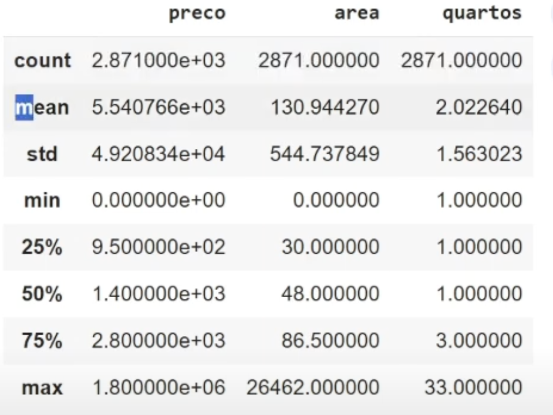
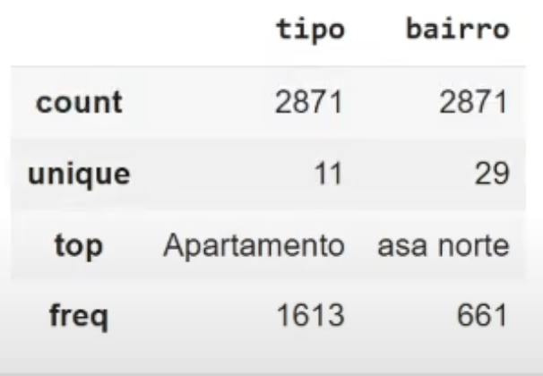

# Introdução ao Pandas

- biblioteca típica para dados
- dataframe: as informações são em formato tabular, de linhas e colunas
    - séries: são uma coluna do dataframe
- permite importar e exportar arquivos de diversos tipos, como csv, excel, json, html, sql e parquet.
    - usando o código `read_csv` (trocar csv por outros arquivos)
    - ele vem dentro de uma variável (normalmente chamada df ou dados)
- o df sempre começa em 0
    - `df.head()` mostra sempre as 5 primeiras linhas
    - `df.tail()` mostra as ultimas 5 linhas

## como usar no vsCode

- para instalar e usar ela no vscode, eu tenho que criar um Virtual Enviroment (venv) do python usando `python3 -m venv .venv`
- depois disso, eu tenho que dizer para ele qual é a source, com o codigo `source ./.venv/bin/activate`
    - essa pasta que eu chamei de .venv e onde está rodando o ambiente virtual não pode subir pro github (criar um .gitignore)
    - todas as minha bibliotecas são instaladas nela
    - para eu mudar de projeto eu devo rodar `deactivate` para desativar e não misturar as bibliotecas dos projetos
- após isso, posso rodar o codigo `pip install` e dizer qual é a biblioteca

- dentro de um arquivo `.py` eu devo escrever `import pandas as pd`

## Seleção de dados

- `df.shape` mostra a quantidade de linhas e colunas
- `df.columns` mostra o nome das colunas
- `df.[nome_da_coluna]` vai mostrar uma das colunas com os dados completos
    - podemos criar uma nova variável usando `nova_variavel = df.[nome_da_coluna]` onde essa variável ja chama apenas a coluna
        - o tipo dessa nova_variavel será `Series`
    - se usarmos apenas `df.nome_da_coluna`
- se formos pegar mais de uma coluna, usamos `df.[['nome_da_coluna1', 'nome_da_coluna2']]`
- `type(nome_da_variável)` vai mostrar o tipo de variável (dataframe é um tipo de variável no pandas)

### iloc

- para visualizarmos apenas algumas linhas
    - `df.iloc[0:15]` (ela exclui a ultima linha digitada)
    - `iloc` só aceita numeros, então as colunas passam a ser numeradas na ordem que estão na db
    - `df.iloc[0:5, 0:2]` seleciona as linhas 0 a 4 e as colunas 0 e 1

### usando condições lógicas

- `df.[df.['nome_da_coluna'] > 2500]`
- onde:
    - 'nome_da_coluna' é a coluna que voce quer analisar
    - e 2500 é referente aos numeros que estão nela
    - só vale para colunas com dado tipo numericos

## resumo sobre os dados

### informações gerais

- função `df.info()` mostra informações gerais da tabela como tipagem, range index, dados das colunas, tipos de dados dentro das colunas
    - possibilita identificar se há valores nulos

### métricas
- usando `df.describe()`
    - ele traz várias métricas ja com seus valores
    
    - onde:
        - count: valor total
        - mean: medio
        - std: desvio padrão
        - min: valor minimo
        - percentis 25, 50, 75
        - max: máximo (percentil 100)
- para ver apenas uma coluna, colocamos `df.nome_da_coluna.describe()`
- da para ver metricas em dados textuais, usando `df.describe(inclune=[object])`
    
    - onde:
        - count: valor do total de linhas
        - unique: quantos valores unicos
        - top: é a moda, qual valor aparece mais
        - freq: frequencia que esse valor top aparece
- contar valores unicos
    - contar quantos valores unicos tem naquela series
        - `df['nome_da_coluna'].nunique`
        - retorna um valor numerico
    - para receber uma lista dos valores unicos (um array), em formato texto mesmo, usamos `df['nome_da_coluna'].unique`
    - para receber o a frequencia (numero) de cada valor unico (texto/numero), usamos `df['nome_da_coluna'].value_counts()`

## Criação de gráficos

- O pandas não é focado em criação de gráficos, mas ajuda
- `df['nome_da_coluna'].value_counts().plot.tipo_de_grafico()`
- tipos de plot
    - bar - barras
    - scatter - pontos, grafico de distribuição
        - dentro dos parenteses tem que colocar o que é o x e o que é o y, com `x='nome_da_coluna, y='outra_coluna'`
    - box
- outliers - dados extremos, fora da curva
    - o grafico box ajuda a identificar

## Manipulação de dados

### filtragem

- pode criar uma nova variável com o filtro
- `df.nova_variavel = df[df['coluna_que_quero_filtrar']< valor]`
    - para fazer um novo filtro em cima do anterior (unindo eles)
        - `df.nova_variavel2 = df.nova_variável[df.nova_variável['nova_coluna']< valor]`

### agrupamento

- consideramos:
    - as categorias que vamos agrupar
    - quais dados queremos
- `nova_variavel2.groupby('categoria')['dados'].forma_de_agrupamento`
    - ex: eu quero agrupar os preços de imoveis (dado) pelo tipo (categoria) de imóvel pela media dos valores
        - `nova_variavel2.groupby('tipo')['preco'].mean`
        - quais outras formas eu poderia agrupar além da média? min, max?

### consultas simples com query

- `df.query('coluna_que_quero_analisar == "dado_que_quero_saber" and/or outra_coluna == 2')`
     - ex: quero saber sobre apartamentos que tenham 2 ou mais quartos
        - `df.query('tipo == "Apartamento" and/or quartos >= 2')`

### criação de novas colunas

- `df['nome_da_nova_coluna'] = variável_que_queremos_inserir`
- ex:
    - quero adicionar uma coluna que seja o preco do metro quadrado
    - `metro_quadrado = df['preco'] / df['area']` para criar a variável que faz o calculo da nova coluna
    - `df['preco_por_m_quadrado'] = metro_quadrado` para definir o nome da nova coluna e os dados que vão nela
