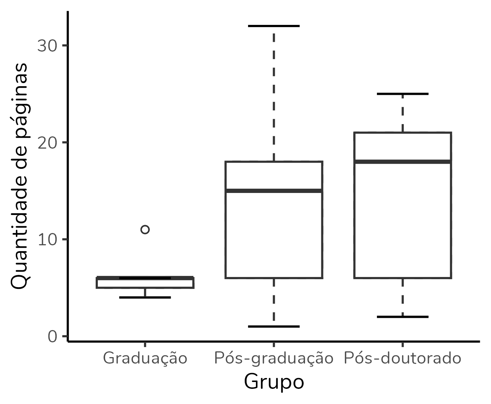
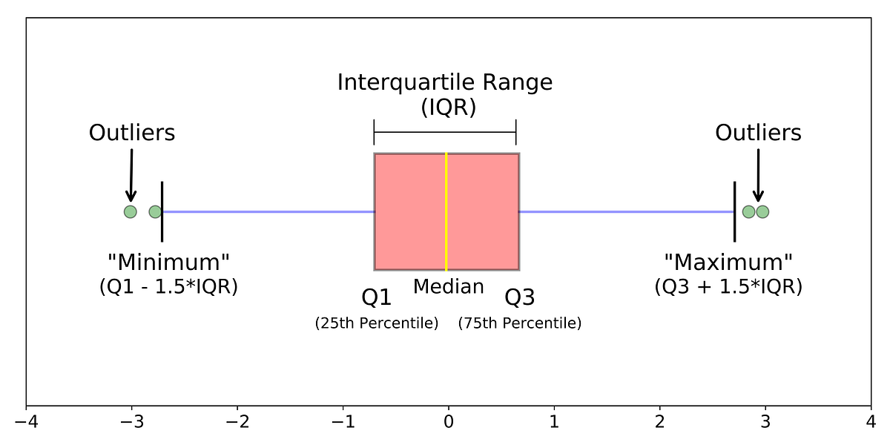

# Limpeza e transformação de dados

- CRISP-DM
    - metodologia mais comum de IA e de ciencia de dados
    - quebra o processo de um projeto em 6 partes
        - entendimento do negocio
        - entendimento e coleta dos dados
        - preparação dos dados
        - modelagem
        - avaliação
        - distribuição/deploy
- dados mal preparados levam a conclusões erradas e podem enviesar o modelo e as análises
- dados sujos = modelos ruins
- é uma parte que demanda muito tempo, é demorada e detalhada
- etapas/esteira do pré-processamento de dados:
    - coleta de dados
    - valores faltantes
    - tipos de dados
    - dados duplicados
    - outliers
    - normalização e padronização
    - dados categóricos

## valores faltantes

- o pandas substitui valores vazios por `NaN`
    - dependendo da base, pode vir com `-`, `?`, `""`, `NULL`
- podemos **preencher** esse dado, se for possível identificá-lo
    - por exemplo, acessos a um site em que a coluna de um di está vazia pois o usuário não entrou no site naquele dia, podemos substituir por 0
    - formas classicas de substituir: média, mediana, moda (quando usar cada uma?)
    - `X.fillna({'age': X['age'].median()}, inplace=True)`
- podemos também **deletar** esses dados, seja linha ou coluna
    - coluna: `df.dropna(axis=1)`
    - linhas: `df.dropna()`
    - tudo, independente de linha ou coluna: `df.dropna(how='all')`

### Quando usar cada forma

- trade-off (equilibrio)
- depende do que voce busca/precisa
- ao deletar, perdemos riqueza de informação
- ao preencher, temo um valor maquiado/artificial
- **BP**
    - valores faltantes < 10% dos dados = deletar
    - entre 10% a 50%, pode preencher, é arriscado
    - valores faltantes > 50% é uma anomalia, desconsidere ela

## Tipos de dados

- importante saber que todos os dados estão com o mesmo tipo, e um tipo que faz sentido, na coluna
    - por exemplo, não faz sentido uma idade estar como string
- para converter todos os dados de uma coluna1
    - `df['coluna1'] = df['coluna1'].astype(str)`
    - str = string
    - int = interger
    - float

## Dados duplicados

- a forma mais fácil de lidar é apagando os duplicados com a função `.drop_duplicates()`
    - podemos usar `'keep: last'` se for pra manter o ultimo, ou first para manter o primeiro
    - podemos usar o parâmetro `subset=nome_da_coluna` para excluir os cuplicados de acordo com uma coluna
- pode agrupar também, pela media, mediana etc, por exemplo quando quer fazer uma análise trimestral e os dados são mensais

## Outliers

- valores que estão muito diferentes dos outros, fora do esperado
- porque aparecem?
    - erros de digitação
    - casos reais que podem indicar fraude
    - mudança no processo de geração dos dados
- porque tratar?
    - puxa a media, distorcendo dados
    - afeta algoritmos
    - confunde gráficos, dificultando a visualização
    - pode ser um dado valioso, demonstrando uma fraude ou um erro
- como identificar?
    - através dos gráficos, principalmente histograma e boxplot
    - no boxplot:
    
        - a linha mais escura representa a mediana
        - os retangulos são a distribuição - os valores ficam entre A (mais baixo) e B (mais alto)
- IQR -  é uma forma estatística para remover outliers
    - é o intervalo entre quartil
    - exclui o que está fora do intervalo correto minimo e máximo
    

## Normalização/padronização

- é importante para, principalmente, modelos de ML
    - se não for feito, o modelo pode entender que alguns dados são mais importantes que outros
- **normalização**
    - faz com que todos os dados fiquem entre 0 e 1 (ou entre -1 e 1)
    - todos os dados ficam numa mesma escala
    - o calculo da normalização, onde X é o valor que queremos normalizar, é
        - `x_norm = (x - xmin) / (xmax - xmin)`
    - a função é a `MinMaxScaler()`
- **padronização**
    - Z-Score standardization
    - faz com que os dados tenham `média = 0` e `desvio padrão = 1`
    - fórmula: `(x - media) / desvio padrão`
- quando usar cada uma?
    

## Dados Categóricos

- tranforma informações em números, visto que algoritmos não leem palavras
- há diferentes tipos de transformações
    - label encoding
        - transforma cada categoria em um numero inteiro
        - bom pra quando há uma ordem, pois ela transforma em numero de acordo com a ordem da coluna
    - one-hot encoding
        - usa apenas 0 e 1
        - transforma as linhas em colunas e coloca o numero 1 quando ela for verdadeira
- quando usar cada uma das duas acima?
    

