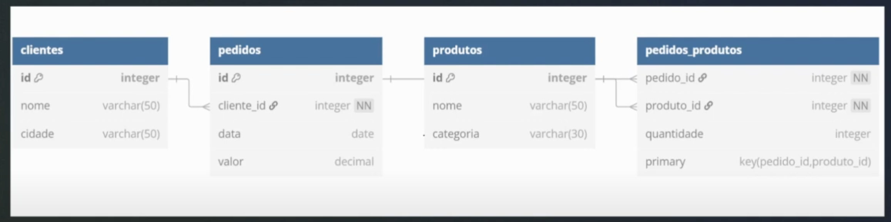

# SQL para Análise de Dados: Queries complexas, joins e subqueries

- schema do exemplo usado na aula

- [queries usadas na aula](https://github.com/luhm/bootcamp-dg/blob/main/semana-2-trilha-ad/s2-a1/queries.sql)

- subquerie
    - em uma unica linha
    - pode atrapalhar na leitura se for uma querie muito longa
    - a primeira subquerie do nosso exemplo é comum para encontrar desvios (muito acima ou muito abaixo)
- subquerie correlacionada
    - comoum para ver evento específicos
    - ex: uma promoção específica da loja
- CTE
    - substituir as subqueries
    - evita duplicação de código
    - se tiver muitas, pode pesar a performance
- window function
    - auxiliam olhar uma situação específica da sua tabela sem precisar usar o `group by`
    - se tiver criando um `rank()`, por exemplo, quem tiver uma qualidade nula ficará em primeiro
    - a função `lag()` faz uma comparação entre o valor que existe na tabela e o anterior a ela
        - é um ranking interno, baseado em uma coluna que voce denomina no `partition by`
    - a função `lead()` faz o contrario da lag, e mostra o valor que voce ta olhando e o próximo
    
